# SIS Rebuild: Creating a Scalable System of Record for Alpha Students

**TL;DR**: The current SIS cannot scale to 200+ schools due to a fragmented data model that makes compliance work slow and difficult, custom-built features (form builder, document signing) that should use industry-standard solutions, and multi-system data fragmentation (HubSpot, SIS, Maxio) causing billing errors. We'll rebuild with clean architecture that supports multi-organization enrollment models (full SIS for Alpha Network Schools, roster-only for Alpha Anywhere and partners), owns billing logic, uses proven third-party tools, and serves as the authoritative roster for all 2-Hour Learning applications.

---

## 1. Overview

**What the SIS Does**

The Student Information System (SIS) serves as the central system of record for all students in the 2-Hour Learning ecosystem. It manages enrollment and rostering across three student populations:

- **Alpha Network Schools** (Alpha Schools, GT.School, NextGen Academy): Full lifecycle management—admissions workflows, enrollment, billing, tuition calculation, student records, parent portal
- **Alpha Anywhere** (online): Enrollment tracking and rostering only (billing handled separately)
- **Third-Party Partner Schools**: Enrollment tracking and rostering only (schools manage their own billing)

The SIS provides the authoritative roster—who has access to what applications—for all downstream systems (DASH, TimeBack, CoachBot), regardless of which organization the student belongs to.

**Core Problem Being Solved**

The current SIS cannot support 2-Hour Learning's growth to 200+ schools across Alpha Network Schools, Alpha Anywhere, and third-party partners due to critical foundational issues: a broken data model that makes compliance requirements impossible to add, over-engineered custom features (form builder, document signing) that should use third-party solutions, and multi-system data fragmentation (HubSpot, SIS, Maxio) creating operational reconciliation burden and billing errors. Additionally, the system lacks proper support for roster-only enrollments (Alpha Anywhere, partner schools) with full auditability.

**Strategic Approach**

Replace the current SIS with a purpose-built **2-Hour Learning SIS** that establishes a single, authoritative source of truth for all student data. The new architecture will support differentiated enrollment models (full admissions/billing for Alpha Network Schools, roster-only for Alpha Anywhere and partners) while maintaining a unified roster for all downstream applications. It will power multiple role-specific views—Parent Portal, Admissions Portal, Registrar Portal—all consuming from the same canonical data model. The SIS will own billing logic rather than delegating it to Maxio's mismatched subscription model, and replace custom-built features with industry-standard third-party solutions where appropriate.

---

## 2. Executive Summary

### The Real Problems

**1. Operational Cost: Staff Spend 80% of Time in Excel Because System Can't Do Their Jobs**

> "80% of what our office does, we're manually doing in Excel right now." — Registrar

**What's Being Done Manually:**
- Immunization tracking (dosages, expiration dates, compliance reminders)
- Daily attendance records
- Behavior incident reports (shared spreadsheets with sensitive student data)
- Transcripts and report cards
- Grades and check charts
- Student progress tracking across multiple campuses

**Why:** The system was built around a fragmented data model that makes it nearly impossible to add new features. A recent attempt to add proper enrollment tracking has been **in progress for an extended period and is still not fully in use** because any change cascades unpredictably through tightly coupled code and systems.

**Business Impact:**
- Registrar FTEs spending 80% time on manual data entry instead of student support
- Significant staff time spent reconciling data across three systems (HubSpot, SIS, Maxio)
- Risk of errors in manual spreadsheets containing sensitive student information
- Cannot respond quickly to compliance requirements or operational needs

**2. Revenue at Risk: Billing Errors Erode Parent Trust**

**Real Example:** Parent sees $40,000 tuition split into 10 monthly $4,000 payments on tuition agreement. Three months later, they're invoiced $40,000 in one charge because billing frequency didn't sync properly. Finance team manually corrects, refunds difference, apologizes. Parent loses trust in Alpha's billing.

**Why This Keeps Happening:**
- Financial calculations exist in **three places** with no guarantee they match: SIS, payment page API, and Maxio
- Systems disagree on enrollment status—which sibling counts as "enrolled" depends on which system you ask
- Finance team must manually verify **every invoice** because they can't trust automated calculations

**Business Impact:**
- Parent trust erosion (critical for retention and referrals)
- Finance team overhead verifying every invoice manually
- Revenue leakage from billing errors
- Poor experience damages Alpha brand

**3. Growth Blocked: Cannot Scale to 200+ Schools Across Multiple Organizations**

**What Alpha Needs to Support:**
- **Alpha Network Schools** (Austin, Miami, etc.): Full admissions pipeline, enrollment management, billing, student records
- **Alpha Anywhere** (online): Enrollment tracking and rostering only (no admissions, no billing)
- **Third-Party Partner Schools**: Enrollment tracking and rostering only (schools manage their own billing)

**Current System Limitations:**
- Single-org architecture: Students can only belong to ONE organization at a time (blocks multi-program enrollment)
- Cannot support main enrollment + ancillary programs (summer camps, tournaments) concurrently
- Student transfers between campuses lose historical context
- No concept of "household" for divorced families with split custody and separate billing
- No differentiation between full-SIS organizations vs roster-only organizations

**Business Impact:**
- Cannot cross-sell ancillary programs to existing families (lost revenue)
- Cannot cleanly onboard Alpha Anywhere or partner schools (blocks growth strategy)
- Cannot properly bill divorced/blended families (operational burden, parent frustration)
- Limits network expansion to 200+ schools

**4. Speed to Market: Year Rollover Requires Re-Engineering Every Time**

**Current Reality:**
- Year rollover requires engineering team involvement and code changes
- Financial data stored with hard-coded year suffixes (283+ references throughout codebase)
- Feature requests take extended time; complex requests difficult or impossible
- Recent migration to fix data model: **ongoing for extended period, still not fully in use**

**Business Impact:**
- Cannot respond quickly to operational needs
- Every school year transition is a high-risk engineering project
- Feature backlog grows faster than delivery capacity
- Engineering team bottleneck prevents operational autonomy

### Proposed Solution

Build a purpose-built **2-Hour Learning SIS** with clean architecture that:

**Eliminates Operational Burden:**
- Core SIS Module addresses "80% in Excel" pain with system-managed immunizations, attendance, behavior tracking, medication management
- Chat interface powered by MCP enables registrars to ask questions in natural language ("Show me all students with missing immunization records") instead of building complex reports
- Single source of truth eliminates data reconciliation burden
- Self-service year rollover (no engineering required)

**Protects Revenue:**
- SIS owns all billing calculations—payment providers (Stripe, EduPaid) are gateways only
- Preview amount = actual amount (no calculation drift)
- Finance team trusts automated billing (no manual verification)

**Enables Growth:**
- Multi-tenant architecture for Alpha Network Schools (full SIS), Alpha Anywhere (roster-only), and Partner Schools (roster-only)
- Multi-program concurrent enrollment (main year + camps + tournaments)
- Household support for divorced/split-custody families with per-household billing
- Authoritative roster for all 2-Hour Learning applications

**Increases Speed to Market:**
- Add features rapidly with clean architecture
- Configuration-driven year rollover (data entry, not code changes)
- Clean domain boundaries (no HubSpot coupling blocking changes)

### Key Principle

**One source of truth for student data, powering multiple views—not multiple systems trying to stay synchronized.**

### Strategic Outcome

Enable 2-Hour Learning to scale to 200+ schools with:
- Operational efficiency: 80% → <20% manual Excel work (registrar FTEs freed for student support); Chat Interface enables instant answers to operational questions
- Revenue protection: zero billing errors, parent trust maintained
- Multi-organization support: Alpha Network Schools, Alpha Anywhere, partner schools in unified system
- Speed to market: features delivered rapidly; year rollover self-service
- Platform foundation: data model supports Parent Portal, Staff Portal, Chat Interface (MCP-powered), and integration APIs
- Modern family support: household-based billing and communication for split-custody families

### Strategic Context: FinalSite Usage & Staff-First Approach

**Business Decision:** FinalSite will handle parent-facing admissions and finance workflows during the transition period (12-18 months). This allows focus on core infrastructure first:

- Build solid SIS backend with proper data model
- Develop staff workflows (registrars, guides) that address "80% in Excel" pain
- Validate architecture with lower-risk staff users before parent-facing features
- Integrate Forms and Finance modules properly into the foundation
- Time to build quality parent experience later with proven architecture

**Staff-First Benefits:**
- Smaller user base: easier rollout and support (staff vs all parents)
- Higher technical sophistication: staff adapt faster to new tools
- Direct support: hands-on training during transition
- Lower reputational risk: staff-facing issues don't erode parent trust
- Validates architecture under real operational load

**Timeline Impact:**
- Faster to first production: staff portals have narrower scope than full parent admissions
- Delayed unified vision: parent portal deferred ~12 months (acceptable trade-off)
- Better parent experience: more time to build, learn from staff usage, deliver quality

After FinalSite contract evaluation, bring parent-facing admissions and re-enrollment workflows in-house to achieve unified Alpha vision.

**See [Migration Plan](https://specs.wseng.ai/projects/trilogy-group%2Fws-eng-specs/specifications/specs%2Feducrm%2Fsis-rebuild%2Fdetail%2Fmigration-plan.md) for complete phased rollout strategy.**

---

## 3. Why Rebuild is Necessary

### We Already Tried Incremental Fixes—They Failed

The engineering team started migrating to proper enrollment tracking. **The migration has been ongoing for an extended period and is still not fully in use** due to tight system coupling where changes cascade unpredictably.

### Why Rebuild Instead of Incremental Fixes?

The system has four foundational problems that must be fixed before any new features can be added:

1. **SIS doesn't own admissions** - Shadow Days require student accounts in SIS, but admissions lives in HubSpot, creating bidirectional sync complexity and duplicate records. HubSpot doesn't enforce business rules, causing data quality issues. **Migration benefit:** Phase 3 (Admissions Portal) eliminates this dependency—all new applications go directly to SIS.

2. **Financial data hard-coded to years** - Many code locations reference `base_tuition2526`. Year rollover requires engineering instead of being self-service configuration.

3. **Single-org architecture** - Students can only belong to one organization, blocking multi-program enrollment (regular year + camps) and making it hard for student to transfer between Alpha Campuses.

4. **No household concept** - Cannot properly bill divorced families (household A pays 50%, household B pays 50%) or scope parent portal by household.

**Incremental approach:** Fix these four foundations → THEN start building features (sequential, long lead time)

**Rebuild approach:** Build correct architecture with features included (parallel, faster time to value)

**Decision:** Rebuild delivers working features in comparable or faster time, with modern foundation instead of patched legacy system.

### Why the Current Architecture Blocks Growth

**The constraint isn't necessarily runtime performance, it's development velocity.** As Alpha grows to 200+ schools, the blocker won't be serving more requests, it will be responding to regulatory requirements, audit requests, and operational changes fast enough to stay compliant and competitive.

The current architecture makes compliance work slow and difficult, forces manual verification of every subscription (payment plan) due to multi-system fragmentation, and forces ancillary programs (summer camps, enrichment) to be managed manually outside the SIS, limiting our ability to efficiently track the full student history across Alpha's entire offering.

### Rebuild Enables the Unified Alpha Student Platform Vision

The SIS rebuild establishes the foundational data model to support Alpha's strategic platform vision: **a single, coherent system managing the entire student lifecycle from application through alumni status**, with role-specific portals (Parent Portal, Admissions Portal, Registrar Portal) all consuming from the same authoritative source of truth.

**Strategic Benefits**:
- **Parent engagement**: Gives parents compelling reasons to regularly log into Alpha's platform (view enrollment, manage billing, track student progress), creating opportunities for Alpha Community growth
- **Cohesive experience**: Parents see all their students and programs in one place instead of fragmented systems
- **Platform foundation**: Establishes the data model to power future parent-facing features

Building these portals on the current fragmented data model would recreate the same synchronization problems we're trying to solve.

### Why Not Commercial SIS?

**Operational Model Mismatch**

Commercial SIS (Veracross, Blackbaud, FACTS, PCREducator, GradeLink) are designed for traditional independent schools with fundamentally different operational models.

**2-Hour Learning's Unique Requirements**:
- **Multi-organization enrollment model**: Must support three distinct enrollment types in one system—Alpha Network Schools (full admissions + billing), Alpha Anywhere (roster-only), and third-party partner schools (roster-only)—with full auditability across all types
- **Multi-program concurrent enrollment**: Main enrollment + ancillary programs (camps, tournaments) as first-class co-equal enrollments—traditional SIS assume one enrollment per year
- **Guide-based coaching**: 1:1 student-guide assignments, not classroom-based instruction
- **Complex stackable discounts**: Sibling + founding family + parent advocate tiers ($2K-40K) + SpaceX subsidy with specific calculation rules (Alpha Network Schools only)
- **200+ school network**: Operating as single logical entity with centralized configuration and network-wide visibility—commercial SIS are per-school or traditional district deployments

**Customization Reality**

In our evaluation, none of the commercial platforms could fully express:
1. Multi-organization enrollment model with different feature sets (full admissions/billing vs. roster-only) in a unified system
2. Alpha's discount stacking logic and proration rules without custom code
3. Main enrollment + ancillary programs as co-equal first-class entities
4. 200+ school network as single unified tenant (not separate environments)
5. Guide model as first-class entity (not repurposed teacher/advisor constructs)

The required customization would be extensive, the multi-school architecture creates operational complexity, and we'd still face vendor lock-in and loss of control over roadmap.

**See [Commercial SIS Evaluation](https://specs.wseng.ai/projects/trilogy-group%2Fws-eng-specs/specifications/specs%2Feducrm%2Fsis-rebuild%2Fdetail%2Fcommercial-sis.md) for detailed analysis.**

---

## 4. Current State Overview

**System Landscape**

The current architecture shows a fragmented multi-system landscape where data is duplicated across HubSpot (admissions), SIS (enrollment), and Maxio (billing), requiring constant manual reconciliation.

**Key Architecture Issues**:
- Bidirectional HubSpot sync creates data fragmentation and consistency issues
- Payment flow spans three systems (SIS, educrm-payment-page, Maxio) with duplicate calculation logic
- API endpoints expose all data without proper scoping (violates OneRoster patterns)
- ~40% dead code (entire grades/assessment system fully implemented but unused)

**Key Technical Decisions That Shaped Current Architecture**

The current system's pain points stem from fundamental architectural decisions made early in development:

| Decision | What Was Chosen | Why It Failed | Business Impact |
|----------|----------------|---------------|-----------------|
| **Enrollment Model** | Emergent from 5+ sources (Role, UserAdmission, metadata, Class, financial) | Cannot query "is student enrolled?" - requires complex multi-table joins | Migration ongoing for extended period, not fully in use; compliance features slow to deliver |
| **Financial Data Storage** | Year-suffixed JSON (`base_tuition2526`) | 283+ hard-coded references prevent queryable data and year rollover | Year rollover requires engineering; cannot support multi-program billing |
| **Authorization** | Role dual-purpose (permissions + enrollment tracking) | Changing role can unenroll students | Cannot build admin UI; unsafe to modify permissions |
| **Multi-Organization** | Single `primary_org` ForeignKey | Students can only belong to ONE org | Blocks multi-program enrollment, cross-campus operations |
| **Admissions Pipeline** | HubSpot owns pipeline, SIS owns enrollment | Shadow Days require bidirectional sync creating drift | Significant reconciliation burden; billing errors from data fragmentation |

**Data Model Problems (High-Level)**

```mermaid
erDiagram
    User ||--o{ Role : "🔴 has (dual purpose)"
    User ||--|| Metadata : "🔴 metadata (financial data)"
    User }o--|| Org : "🔴 primary_org (single)"
    User ||--o| UserAdmission : "admissions"
    User ||--o{ ProgramEnrollment : "enrollments"
    User ||--o{ StudentFinancialInfo : "financial_info"
    User ||--o{ Enrollment : "class enrollments"
    User ||--o{ UserForm : "forms"
    
    UserAdmission ||--|| ProgramEnrollment : "links to"
    
    ProgramEnrollment }o--|| ProgramSession : "program_session"
    ProgramEnrollment ||--o{ StudentFinancialInfo : "✅ financial_info"
    ProgramEnrollment ||--o{ UserForm : "⚠️ (nullable)"
    
    ProgramSession }o--|| Org : "org"
    
    Role }o--|| Org : "org"
    
    Enrollment }o--|| ClassEntity : "class_ref"
    Enrollment }o--|| Org : "school"
    
    ClassEntity }o--|| Course : "💀 course"
    ClassEntity }o--|| Org : "💀 school"
    ClassEntity }o--o{ AcademicSession : "💀 terms"
    
    Course }o--|| AcademicSession : "💀 school_year"
    Course }o--|| Org : "💀 org"
    
    User {
        uuid sourced_id PK
        string username UK
        string email UK
        string first_name
        string last_name
        string grade_level "🔴 should be enrollment-specific"
        string level "🔴 should be enrollment-specific"
        uuid primary_org FK "🔴 enforces single org"
        uuid metadata FK "🔴 contains financial data"
    }
    
    Metadata {
        json extensions "🔴 Unstructured JSON (contains: base_tuition2526, adjusted_tuition2526, monthly_payment2526, tuition_profile2526, etc.)"
    }
    
    Role {
        uuid id PK
        string role_type
        string role "🔴 PRIMARY_STUDENT for enrollment"
        date begin_date
        date end_date
        uuid org FK
        uuid user_profile FK
    }
    
    UserAdmission {
        uuid sourced_id PK
        uuid user FK "⚠️ UNIQUE with program_enrollment"
        uuid program_enrollment FK "⚠️ UNIQUE with user"
        uuid sub_step FK "⚠️ separate table instead of status field"
    }
    
    ProgramEnrollment {
        uuid sourced_id PK
        uuid user FK
        uuid program_session FK
        string grade_level
        string level
        date enrollment_date
        date withdraw_date
        string hubspot_deal_id
        string deal_stage
    }
    
    StudentFinancialInfo {
        uuid sourced_id PK
        uuid user FK "✅ UNIQUE with program_enrollment"
        uuid program_enrollment FK "✅ UNIQUE with user"
        decimal base_tuition "✅ Proper structure"
        decimal adjusted_tuition
        decimal monthly_payment
        decimal founding_family_discount
        decimal sibling_discount
        decimal parent_advocate_discount
        decimal spacex_subsidy
        string lunch_program
        decimal lunch_amount
    }
    
    ProgramSession {
        uuid sourced_id PK
        uuid org FK
        string name
        integer school_year "⚠️ No UK on org+year"
        string session_type
        date start_date
        date end_date
        string hubspot_session_id
    }
    
    Enrollment {
        uuid sourced_id PK
        uuid user FK "⚠️ Confusing model name"
        uuid class_ref FK
        uuid school FK
        string role
        date begin_date
        date end_date
    }
    
    UserForm {
        uuid sourced_id PK
        uuid user FK
        uuid form FK
        uuid program_enrollment FK "⚠️ nullable - legacy issue"
        boolean submitted
    }
    
    Org {
        uuid sourced_id PK
        string name
        string type
        uuid parent FK
        decimal base_tuition
        decimal deposit_amount
    }
    
    ClassEntity {
        uuid sourced_id PK "💀 Unused grades system"
        string title
        string class_code
        uuid course FK
        uuid school FK
    }
    
    Course {
        uuid sourced_id PK "💀 Unused grades system"
        string title
        string course_code
        uuid school_year FK
        uuid org FK
    }
    
    AcademicSession {
        uuid sourced_id PK "💀 Unused grades system"
        string title
        date start_date
        date end_date
        string type
        string school_year "⚠️ Different from ProgramSession"
    }
```

**Legend:**
- 🔴 Critical Issue - Data model failure preventing core functionality
- ⚠️ Design Problem - Needs improvement, causes friction
- ✅ Well Designed - Good pattern to follow
- 💀 Dead Code - ~40% of codebase unused

The diagram shows how enrollment is emergent from 5+ sources rather than being a first-class entity. [See detailed data model analysis](https://specs.wseng.ai/projects/trilogy-group%2Fws-eng-specs/specifications/specs%2Feducrm%2Fsis-rebuild%2Fdiagrams%2Fdata-model-current.md) for complete breakdown of issues.

**Critical Issues**:
1. **Enrollment is emergent**: Inferred from 5+ fragmented sources (Role table, UserAdmission status, User.metadata, Class records, financial JSON)—no atomic entity to query or audit
2. **Year-suffixed JSON fields**: 283+ references to `metadata.extensions` with hard-coded year suffixes (`base_tuition2526`) prevent queryable financial data and configuration-driven year rollover
3. **Financial data duplication**: Legacy JSON column + `StudentFinancialInfo` table + HubSpot + Maxio—migration ongoing for extended period and not fully in use, creates drift risk and billing errors
4. **Role dual-purpose**: Both authorization (RBAC) and enrollment tracking (PRIMARY_STUDENT = enrolled)—changing roles can unenroll students
5. **Single-org limitation**: `User.primary_org` single ForeignKey blocks multi-program enrollment and cross-campus operations
6. **No household entity**: Cannot support divorced/split-custody families with separate billing per household
7. **Snapshot-based history**: Full record copies, not field-level changes—cannot query "what changed"
8. **Scattered RBAC**: 2,000-4,000 lines of duplicated permission logic across 179 files

**See [Current State Analysis](https://specs.wseng.ai/projects/trilogy-group%2Fws-eng-specs/specifications/specs%2Feducrm%2Fsis-rebuild%2Fdetail%2Fcurrent-state.md) for detailed documentation.**

---

**Note**: Sections 5-7 below provide high-level direction for the target architecture and implementation approach. Detailed technical specifications are in development and will be documented in separate ITD documents referenced in Section 7.

---

## 5. Target Architecture

### 5.1 Fundamental Architectural Decisions

The target system is built on 15 foundational decisions that correct the current architecture's flaws:

**Data Model Decisions:**

| Decision | Target Approach | Business Impact |
|----------|----------------|-----------------|
| **1. Enrollment Entity** | First-class immutable entity (one record per stint) | Enables attendance, transcripts, behavior tracking, portals |
| **1A. Continuous Enrollments** | Support session-based + continuous programs (multiple stints per offering) | Alpha Anywhere, partner schools with rolling enrollment |
| **2. Financial Data** | Normalized tables (EnrollmentFinancials, EnrollmentDiscount) | Self-service year rollover, multi-program billing |
| **3. Authorization vs Enrollment** | Separate Permission and Enrollment entities | Safe role management, granular permissions |
| **4. Multi-Organization** | Multi-tenant (enrollments in multiple orgs) | 200+ school growth, concurrent programs |
| **9. Family Structures** | Household as first-class entity | Split-custody billing, per-household portals |
| **11. Org Hierarchy** | Hierarchical with materialized path | Network reporting, rollups |
| **12. Org Types** | FULL_SIS vs ROSTER_ONLY feature scoping | Alpha Anywhere, partner schools |
| **13. Student ID** | UUID (internal) + sequential (user-facing) | Support efficiency, human-readable |

**System Boundaries Decisions:**

| Decision | Target Approach | Business Impact |
|----------|----------------|-----------------|
| **5. Billing Logic** | SIS owns calculations (with opt-out for ROSTER_ONLY orgs), Stripe/EduPaid are gateways | Preview = actual amount, no drift |
| **7. External Integration** | Event-driven with clean boundaries | Feature development without HubSpot coupling |
| **14. Admissions Pipeline** | SIS owns application → enrollment lifecycle | Unified parent portal, no HubSpot sync |

**Operational Design Decisions:**

| Decision | Target Approach | Business Impact |
|----------|----------------|-----------------|
| **6. Permissions** | Centralized RBAC (permission matrix) | Add features rapidly |
| **8. Audit Trail** | Field-level events with business context (staff-only visibility) | Compliance, troubleshooting |
| **10. Enrollment Forms** | DocuSign (legal) + workflow steps (data collection) | Better UX, less maintenance |

---

### 5.2 Module Architecture & Responsibilities

**System Architecture Overview:**

The target architecture shows a clean separation between backend modules, frontend portals, and external integrations through well-defined boundaries.

**Backend Modules:**
- **Core SIS:** Student profiles, Households, Enrollment lifecycle, Organizations (hierarchical), Attendance tracking, Health records (immunizations, medications, allergies), Behavior/incident management
- **Admissions:** Applications, Shadow Days, Offers
- **Financial:** Payment schedules, billing calculations, Stripe/EduPaid integration (see [Financial Module Spec](https://specs.wseng.ai/projects/trilogy-group%2Fws-eng-specs/specifications/specs%2Feducrm%2Fsis-financial-rebuild%2Fsis-financial-rebuild.spec.md))
- **Forms:** DocuSign integration, health/emergency data collection (see [Forms Module Spec](https://specs.wseng.ai/projects/trilogy-group%2Fws-eng-specs/specifications/specs%2Feducrm%2Fsis-forms-rebuild%2Fsis-forms-rebuild.spec.md))
- **Reporting:** AI-based reporting with natural language queries (MCP-powered Chat Interface), Google Sheets sync, CSV export, operational dashboards
- **Integration Platform:** Developer portal with API docs, sandbox environment, API versioning, API key management, webhook registration, OneRoster API, event bus (outbound notifications), MCP tools (enables Chat Interface and external LLM agents)

**Frontend Applications:**
- **Parent Portal** (external): Consumer UX for parents/guardians (deferred to future phase—see Strategic Context)
- **Staff Portal** (internal): Role-based views for registrars, guides, finance, directors, admins
- **Chat Interface** (internal): Natural language query interface for staff powered by MCP—ask questions like "Show me all students with missing immunization records" or "Which families have outstanding balances over $1,000?" and get instant answers

**Note:** Staff portal is built incrementally during migration:
- Phase 5: Registrar workflows (first production UI)
- Phase 6: Reporting module (AI-based natural language queries)
- Phase 8: All-at-once cutover (all registrars/guides migrate simultaneously)
- **FinalSite Integration:** Parent-facing admissions handled by FinalSite during Phase 1 (pull pattern)

**Shared Infrastructure:**
- **Authentication & Authorization:** Cognito for auth, RBAC for role-based access control
- **API Gateway:** API Keys for internal service-to-service communication, shared by both portals

**Module Dependencies:**
- Core SIS is foundation (no dependencies)
- Admissions, Financial, Forms modules depend on Core SIS (Enrollment entity)
- Integration Platform consumes domain events and publishes to external systems (HubSpot, TimeBack, DASH)
- Reporting module consumes data from all modules (read-only)

**Data Model Anchor:**

> **Note:** Complete data model diagrams are maintained in individual module specifications (Core SIS, Financial, Forms, Admissions). Each module owns its entities; modules integrate via foreign keys to Core SIS entities. See [Module Specs](https://github.com/trilogy-group/ws-eng-specs/blob/c2a73da93bc93f0cfe94e65bff00a6b126ee5524/specs/educrm/sis-rebuild/modules) and [Financial Module Spec](https://specs.wseng.ai/projects/trilogy-group%2Fws-eng-specs/specifications/specs%2Feducrm%2Fsis-financial-rebuild%2Fsis-financial-rebuild.spec.md) / [Forms Module Spec](https://specs.wseng.ai/projects/trilogy-group%2Fws-eng-specs/specifications/specs%2Feducrm%2Fsis-forms-rebuild%2Fsis-forms-rebuild.spec.md) for detailed entity definitions and relationships.

The target data model corrects the fundamental flaws in the current system:

| Core Entity | Purpose | Key Fix |
|-------------|---------|---------|
| **User** | Authentication identity (parents, staff, students who have portal access) | Agent who can log in and take actions |
| **Student** | Student record (first-class entity) | Can be enrolled; separate from User to prevent nonsensical enrollments (e.g., enrolling a parent) |
| **Enrollment** | First-class enrollment record (one per stint) | Replaces emergent enrollment inferred from 5+ sources |
| **Household** | Family structure and billing scope | New entity enables split-custody billing, per-household portals |
| **Organization** | Hierarchical org structure with path | Multi-tenant with ORG_TREE support (brand → campuses → programs) |
| **ProgramOffering** | Year-specific program instance | Replaces year-suffixed JSON with queryable data |
| **Permission** | RBAC grants (role + scope) | Separates authorization from enrollment (Role table dual-purpose failure) |
| **EnrollmentFinancials** | Normalized financial data per enrollment | Replaces hard-coded `base_tuition2526` JSON fields |

**Key Conceptual Distinction:**
- **User**: agent who logs in (parent, staff, student with portal access)
- **Student**: subject of education, can be enrolled
- **Household**: family unit containing agents (who manage) + students (who are managed)

Students may optionally have User records for portal access. Parents are Users but not Students. Schema enforces: only Students can have Enrollments.

**Key Relationships:**
- **Student** → Enrollments (many per student for multi-program)
- **Enrollment** → ProgramOffering (what they're enrolled in)
- **Enrollment** → EnrollmentFinancials (billing for this enrollment)
- **Household** → Agents (Users who manage: parents/guardians)
- **Household** → Students (students being managed)
- **User** → Permissions (role grants with hierarchical scope)
- **Student** → User (optional, if student has portal access)

**See [Target Architecture Detail](https://specs.wseng.ai/projects/trilogy-group%2Fws-eng-specs/specifications/specs%2Feducrm%2Fsis-rebuild%2Fdetail%2Ftarget-architecture.md) for complete entity definitions, schema design, portal architecture, and API contracts.**

### 5.3 Integration & Ecosystem

**Ecosystem Architecture:**

The ecosystem architecture shows how the new SIS integrates with external systems through event-driven patterns and standard APIs, with clear boundaries and loose coupling.

**System Boundaries:**

| System | Role | Integration Pattern |
|--------|------|-------------------|
| **SIS** | Source of truth for enrollment, billing logic (FULL_SIS), admissions | N/A |
| **Chat Interface (Staff)** | Natural language query interface (Reporting Module) | MCP Tools from Integration Platform |
| **HubSpot** | Marketing automation only | Events (SIS → HubSpot) |
| **Stripe** | Payment gateways (see [Financial Module Spec](https://specs.wseng.ai/projects/trilogy-group%2Fws-eng-specs/specifications/specs%2Feducrm%2Fsis-financial-rebuild%2Fsis-financial-rebuild.spec.md)) | REST API (SIS calculates, they collect) + Webhooks |
| **DocuSign** | Legal signatures (see [Forms Module Spec](https://specs.wseng.ai/projects/trilogy-group%2Fws-eng-specs/specifications/specs%2Feducrm%2Fsis-forms-rebuild%2Fsis-forms-rebuild.spec.md)) | REST API + Webhooks |
| **DASH/TimeBack/CoachBot** | Learning apps | OneRoster API + Events |
| **Alpha Anywhere** | ROSTER_ONLY org | REST API (enrollment CRUD) |
| **Partner Schools** | ROSTER_ONLY org | REST API (enrollment CRUD) |

**Event-Driven Architecture:**
- SIS publishes events (enrollment.created, enrollment.withdrawn, application.accepted)
- External systems subscribe (HubSpot for marketing, learning apps for roster updates)
- Loose coupling enables independent evolution

**Standards Adoption:**
- **OneRoster 1.2** for rostering (downstream learning platforms) - **STANDARD for all integration APIs**
  - All integration endpoints (DASH, TimeBack, Alpha Anywhere, partner schools) follow OneRoster 1.2 specification
  - API authentication: API keys with customizable permissions (scope-based, intent-based, organization-scoped)
  - Batch operations: OneRoster pattern (same endpoint handles single and batch operations)
  - HATEOAS links: Included in integration API responses for resource discovery
- **Model Context Protocol (MCP)** for LLM agent interaction (enables AI copilots for staff)
- **DocuSign** for legally binding signatures
- **OAuth 2.0** for external integrations
- **Industry-standard webhooks** with retry and delivery guarantees

**Developer Platform:**

The Integration Platform provides a developer-facing product (not just internal infrastructure) to enable partner schools and external systems to integrate:

- **API Documentation Portal:** Interactive docs with code samples (multiple languages)
- **Sandbox Environment:** Test integrations without affecting production data, isolated test data generation
- **API Versioning:** Semantic versioning (e.g., `/v1/`, `/v2/`) with deprecation policy and backward compatibility guarantees
- **Self-Service Onboarding:** Partner schools can generate API keys, register webhooks, configure integrations
- **Usage Monitoring:** Rate limits, quota management, usage analytics dashboard
- **Webhook Testing Tools:** Simulate events, inspect payloads, debug delivery failures

This positions the SIS as an **integration-friendly platform** critical for scaling to 200+ schools and supporting ROSTER_ONLY organizations (Alpha Anywhere, partner schools).

**MCP Tools for Chat Interface:**

The Integration Platform provides **Model Context Protocol (MCP)** tools that power the Chat Interface (part of Reporting Module). These tools enable:
- Permission-aware queries respecting RBAC
- Natural language to structured query translation
- Real-time data access across all modules
- Audit trail for all queries

**Example Chat Interface queries:**
- "Show me all 5th graders with incomplete immunization records"
- "Which families have outstanding balances over $1,000?"
- "What's our enrollment trend by month for the past year?"

This addresses the **"80% in Excel" pain point** by eliminating manual data export and analysis—staff simply ask questions and get answers.

**See [Target Architecture Detail](https://specs.wseng.ai/projects/trilogy-group%2Fws-eng-specs/specifications/specs%2Feducrm%2Fsis-rebuild%2Fdetail%2Ftarget-architecture.md) for complete integration patterns, event schemas, and API specifications.**

### 5.4 SIS Scope: All 2-Hour Learning Schools

**Question:** Is this SIS for all schools we'll sell TimeBack to, or just schools we own?

**Answer:** **All schools using the 2-Hour Learning model** - owned schools, Alpha Anywhere, AND third-party partner schools.

**Why:** The SIS provides the authoritative roster determining who has access to learning applications (DASH, TimeBack, CoachBot). This makes it the **2-Hour Learning SIS**, not just an Alpha Schools SIS.

**Organization Types:**

| Type | Examples | SIS Features | Billing |
|------|----------|--------------|---------|
| **FULL_SIS** | Alpha Schools, GT.School, NextGen Academy | Full admissions + billing + enrollment | SIS-owned |
| **ROSTER_ONLY** | Alpha Anywhere, partner schools | Enrollment tracking only | External or opt-out |

**Access Control Model:**
- `Enrollment.status = ACTIVE` → student has app access
- Single roster for all organizations (learning apps don't need to know org type)
- Full audit trail regardless of organization type

---

## 6. Migration Approach

### Migration Philosophy

**Clean Break, All-at-Once Cutover**: The migration strategy prioritizes clarity and speed over incremental transition. Build the new system completely, migrate historical data once, then switch users over all at once. No dual-system period eliminates confusion, training complexity, and data synchronization issues.

**Key Principles:**
1. **Build complete foundation first** - Core backend, APIs, and staff workflows before user migration
2. **Continuous validation** - Daily sync from old to new system provides realistic test data throughout development
3. **De-risk integrations early** - Convert external integration endpoints to proxies before user cutover
4. **Internal validation before cutover** - Staff test thoroughly and confirm readiness
5. **All-at-once user migration** - All registrars/guides switch simultaneously (no pilot groups)
6. **Clean decommission** - Remove old system completely after validation period

### High-Level Migration Strategy

**Foundation Phase:**
Build core SIS backend with proper data model, integration APIs (OneRoster-compliant), and staff portal with essential registrar workflows. Establish daily sync mechanism (old SIS → new SIS) to provide realistic test data for development and validation.

**De-Risking Phase:**
Convert existing integration endpoints to proxies that write to new SIS while maintaining compatibility. External systems (DASH, TimeBack, Alpha Anywhere) continue working unchanged. Provide sandbox environment and documentation for integrator testing.

**Validation Phase:**
Internal validation by registrars confirms they can perform all essential operations. Verify Google Sheets reports, support documentation, and all user groups are ready. No pressure—take time needed to confirm readiness.

**Cutover Phase:**
All-at-once user migration: cut off old SIS access for all registrars/guides simultaneously. Integration endpoints remain active (proxied to new SIS). Admissions workflows remain on FinalSite during initial phase.

**Decommission Phase:**
After 90+ day validation period with no issues, archive old SIS database and remove servers completely.

### FinalSite Usage Context

During the transition period (12-18 months), **FinalSite handles parent-facing admissions** workflows. This strategic decision:
- Allows focus on building solid SIS backend and staff workflows first
- Reduces initial scope and risk (staff-only rollout vs. all parents)
- Provides time to validate architecture with staff users before building parent features
- Enables higher-quality parent experience when eventually built

After FinalSite contract evaluation, bring parent-facing workflows in-house to achieve unified Alpha vision.

### Why This Approach Reduces Risk

**Continuous Validation:**
Daily sync provides realistic test data throughout development. Staff validate data accuracy over months, not under pressure before cutover.

**Early Integration De-Risking:**
External integration endpoints become proxies early, long before user cutover. DASH, TimeBack, Alpha Anywhere continue working unchanged.

**Staff-First Rollout:**
Smaller user base (registrars/guides vs. all parents), higher technical sophistication, direct support available, validates architecture under real load, lower reputational risk if issues occur.

**Clean Break:**
No dual-system period eliminates confusion, duplicate work, data synchronization complexity, and split attention. Staff learn one system, not how to navigate between two.

**Internal Validation Gate:**
Registrars confirm readiness before cutover. If not ready, we wait. No pressure to meet arbitrary deadlines.

**See [Migration Plan Detail](https://specs.wseng.ai/projects/trilogy-group%2Fws-eng-specs/specifications/specs%2Feducrm%2Fsis-rebuild%2Fdetail%2Fmigration-plan.md) for complete phase-by-phase breakdown, technical implementation details, dependencies, success criteria, and rollback strategies.**

---

## 7. Next Steps

### Supporting Documentation

This spec provides the strategic and architectural overview for decision-making. Detailed technical documentation for implementation:

**Current State:**
- **[Current State Analysis](https://specs.wseng.ai/projects/trilogy-group%2Fws-eng-specs/specifications/specs%2Feducrm%2Fsis-rebuild%2Fdetail%2Fcurrent-state.md)**: Critical architecture failures, integration issues, impact by user type
- **[Commercial SIS Evaluation](https://specs.wseng.ai/projects/trilogy-group%2Fws-eng-specs/specifications/specs%2Feducrm%2Fsis-rebuild%2Fdetail%2Fcommercial-sis.md)**: Why Veracross, Blackbaud, etc. don't fit 2-Hour Learning's model
- **[Use Cases Detail](https://specs.wseng.ai/projects/trilogy-group%2Fws-eng-specs/specifications/specs%2Feducrm%2Fsis-rebuild%2Fdetail%2Fuse-cases.md)**: Main use cases by actor (parents, admissions, registrars, finance, guides, etc.)
- **[Registrar Requests Assessment](https://specs.wseng.ai/projects/trilogy-group%2Fws-eng-specs/specifications/specs%2Feducrm%2Fsis-rebuild%2Fcontext%2Fcurrent-sis%2Fregistrar-requests-assessment.md)**: Feature feasibility analysis for existing feature requests

**Target Architecture:**
- **[Target Architecture Overview](https://specs.wseng.ai/projects/trilogy-group%2Fws-eng-specs/specifications/specs%2Feducrm%2Fsis-rebuild%2Fdetail%2Ftarget-architecture.md)**: Module responsibilities, key architectural patterns, data flow examples, technology choices
- **[Data Model](https://specs.wseng.ai/projects/trilogy-group%2Fws-eng-specs/specifications/specs%2Feducrm%2Fsis-rebuild%2Fdetail%2Fdata-model.md)**: Complete entity relationship diagrams and schema definitions for all core entities
- **[Core SIS Module](https://specs.wseng.ai/projects/trilogy-group%2Fws-eng-specs/specifications/specs%2Feducrm%2Fsis-rebuild%2Fmodules%2Fcore.spec.md)**: Core SIS module specification with ITDs for enrollment, household, organization, permissions, and audit trail
- **[Admissions Module](https://specs.wseng.ai/projects/trilogy-group%2Fws-eng-specs/specifications/specs%2Feducrm%2Fsis-rebuild%2Fmodules%2Fadmissions.spec.md)**: Admissions module specification covering application pipeline, shadow days, and enrollment creation
- **[Module Specs Directory](https://github.com/trilogy-group/ws-eng-specs/blob/c2a73da93bc93f0cfe94e65bff00a6b126ee5524/specs/educrm/sis-rebuild/modules)**: Additional module specifications (see MODULE-SUMMARY.md for complete index)
- **[Financial Module Specification](https://specs.wseng.ai/projects/trilogy-group%2Fws-eng-specs/specifications/specs%2Feducrm%2Fsis-financial-rebuild%2Fsis-financial-rebuild.spec.md)**: Complete ITD-level spec for direct Stripe integration, billing calculations, payment schedules, discount stacking, component pricing
- **[Forms Module Specification](https://specs.wseng.ai/projects/trilogy-group%2Fws-eng-specs/specifications/specs%2Feducrm%2Fsis-forms-rebuild%2Fsis-forms-rebuild.spec.md)**: Complete ITD-level spec for DocuSign integration, parent document signing, data collection forms, enrollment context
- **[Platform Infrastructure Specs](https://github.com/trilogy-group/ws-eng-specs/blob/c2a73da93bc93f0cfe94e65bff00a6b126ee5524/specs/educrm/sis-rebuild/platform)**: Auth & RBAC (auth-rbac.spec.md), Integration Platform (integration.spec.md), Reporting (reporting.spec.md)

**Migration:**
- **[Migration Plan Detail](https://specs.wseng.ai/projects/trilogy-group%2Fws-eng-specs/specifications/specs%2Feducrm%2Fsis-rebuild%2Fdetail%2Fmigration-plan.md)**: Clean break migration approach, 9-phase implementation, all-at-once cutover, rollback strategies, risk mitigation
- **[User Migration Plan](https://specs.wseng.ai/projects/trilogy-group%2Fws-eng-specs/specifications/specs%2Feducrm%2Fsis-rebuild%2Fdetail%2Fuser-migration-plan.md)**: User migration and onboarding strategy

**Implementation Planning:**
- **[Implementation Plan](https://specs.wseng.ai/projects/trilogy-group%2Fws-eng-specs/specifications/specs%2Feducrm%2Fsis-rebuild%2Fdetail%2Fimplementation-plan.md)**: Tactical implementation approach with technical details and sequencing
- **[Phase 1 Epic Design Docs](https://specs.wseng.ai/projects/trilogy-group%2Fws-eng-specs/specifications/specs%2Feducrm%2Fsis-rebuild%2Fepics%2Fphase-1-edds.md)**: Complete list of EDDs needed for Phase 1 (Registrar Portal + Core SIS + Reporting + OneRoster), with goals, dependencies, and sequencing

---

## Appendices

### Appendix A: Key Terminology

- **Alpha Network Schools**: 2-Hour Learning operated physical schools including Alpha Schools, GT.School, and NextGen Academy. These schools use the full SIS capabilities (admissions, billing, enrollment management).
- **Enrollment Stint**: One continuous period of enrollment (enroll → withdraw/graduate)
- **Program**: Enduring offering (e.g., "Alpha Regular Year", "Summer Math Camp")
- **Program Offering**: Year-specific instance of a program (e.g., "Alpha Regular Year 2025-2026")
- **Guide**: 1:1 coach assigned to student (not a teacher in traditional sense)
- **Shadow Day**: Trial day for prospective students with feedback workflow
